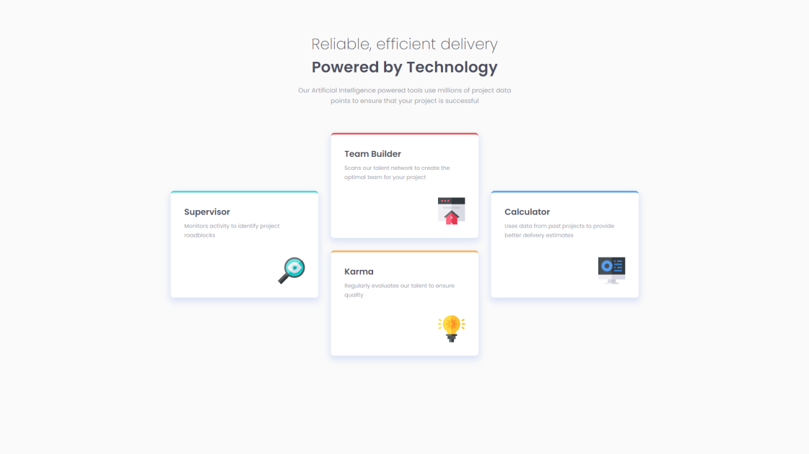

# Frontend Mentor - Four card feature section solution

This is a solution to the [Four card feature section challenge on Frontend Mentor](https://www.frontendmentor.io/challenges/four-card-feature-section-weK1eFYK). Frontend Mentor challenges help you improve your coding skills by building realistic projects. 

## Table of contents

- [Overview](#overview)
  - [Screenshot](#screenshot)
  - [Links](#links)
- [My process](#my-process)
  - [Built with](#built-with)
  - [Useful resources](#useful-resources)
- [Author](#author)

## Overview

### Screenshot

### Links

- Solution URL: [Frontend Mentor](https://www.frontendmentor.io/solutions/flexbox-four-card-feature-section-Loy2CKpTHW)
- Live Site URL: [Site](https://four-card-feature-section-master-brown.vercel.app/)

## My process

### Built with

- Semantic HTML5 markup
- CSS custom properties
- Flexbox
- CSS pseudo-class
- Media queries

### Useful resources

- [MDN Docs](https://developer.mozilla.org/) - I got the basic information from this resource.
- [htmlbook.ru](http://htmlbook.ru/) - And from this resource too.
- [html5book.ru](https://html5book.ru/) - And from this.
- [Stack Overflow](https://stackoverflow.com/) - I found answers and solutions to many questions here.

## Author

- Frontend Mentor - [@zogxo](https://www.frontendmentor.io/profile/zogxo)